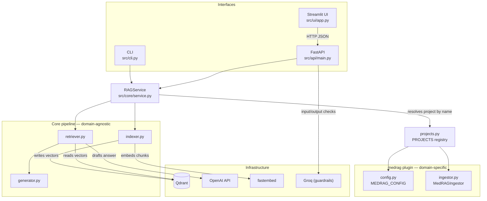
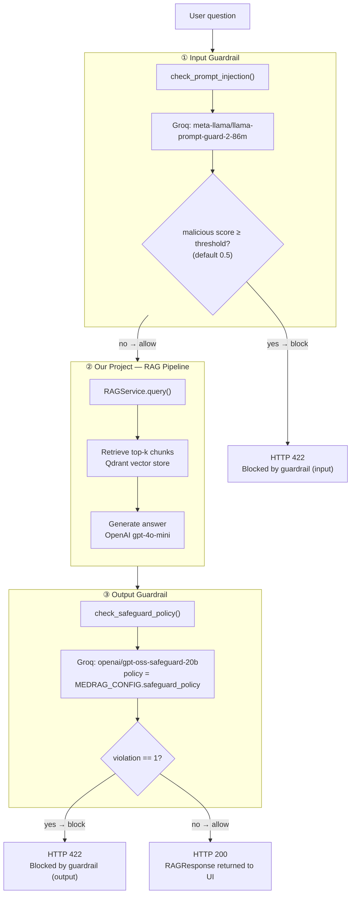
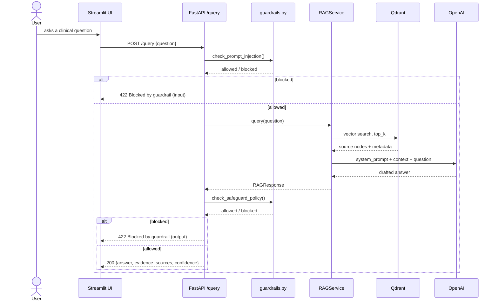
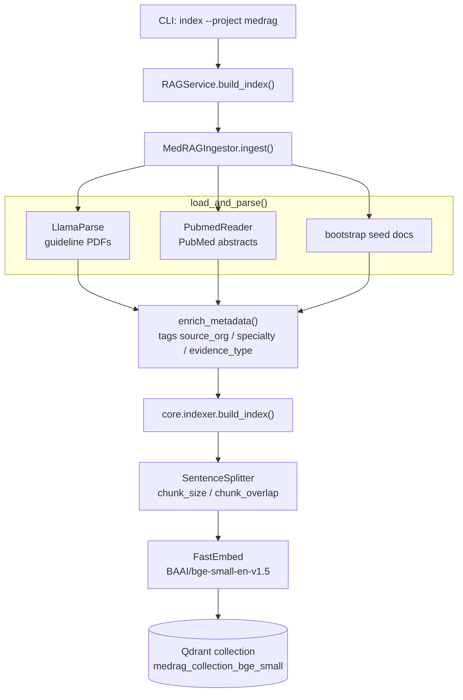
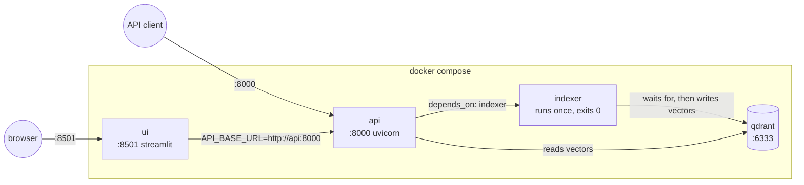

# MedRAG

Clinical guideline Q&A powered by a shared, plugin-based RAG toolkit. One domain-agnostic core (`src/core/`) drives retrieval, generation, evaluation, and safety guardrails; a project plugin (`src/projects/medrag/`) supplies the domain-specific ingestion and policy. Three thin interfaces — CLI, FastAPI, and a Streamlit UI — all sit on top of the same `RAGService`.

> **Branch scope:** `feature/io-guardrails` adds API-boundary input and output safety checks, diagnostic endpoints, and a Guardrails UI tab. These controls fail open and do not run for CLI or evaluation calls; review [Guardrails](#guardrails) before production use.

The illustrated [MedRAG project report](output/pdf/MedRAG_Project_Report.pdf) gives a concise problem statement, operating model, architecture, implementation map, safety posture, product walkthrough, and recommended next steps.

MedRAG is an educational evidence assistant. It does not diagnose, prescribe, replace a clinician, or establish that its indexed guidance is complete or current.

## Stack

- **Vector store**: Qdrant
- **Embeddings**: FastEmbed (`BAAI/bge-small-en-v1.5`, local, no API key needed)
- **Generation**: OpenAI (`gpt-4o-mini` by default)
- **Document parsing**: LlamaParse (guideline PDFs) + PubMed (`PubmedReader`)
- **Guardrails**: Groq-hosted Prompt Guard (input) and a policy-driven safeguard model (output)
- **Eval**: DeepEval (faithfulness, answer relevancy, contextual relevancy) against a golden dataset

## Architecture



## Guardrails

Guardrails live **only** at the API boundary (`src/api/main.py`'s `/query` handler) — they wrap `RAGService.query()` rather than living inside it, so the CLI and the eval harness bypass both checks and are never affected by a guardrail false positive. Both guards are Groq-hosted models called via `src/core/guardrails.py` and **fail open**: a Groq timeout, auth error, or malformed response is logged and the request is allowed through rather than blocked, so a Groq outage degrades the app to unguarded behavior instead of taking query-answering down entirely.



The Streamlit **Guardrails** tab hits two dedicated diagnostic endpoints — `POST /guardrails/test-input` and `POST /guardrails/test-output` — that call each layer directly, skipping retrieval/generation entirely, so you can sanity-check guard behavior without burning an OpenAI call.

## Query flow



## Index build flow

Triggered by `rag-toolkit index --project medrag` (the Docker `indexer` service runs this once on startup, then exits).



`--skip-if-exists` short-circuits if the collection already exists.

## Deployment topology



`ui` never touches Qdrant or `RAGService` directly — it's a pure HTTP client of `api`.

## Quick start

```bash
cp .env.example .env
# fill in OPENAI_API_KEY, LLAMA_CLOUD_API_KEY, and (optionally) GROQ_API_KEY
docker compose up -d
```

- UI: http://localhost:8501
- API docs: http://localhost:8000/docs

### Environment variables

| Variable | Default | Purpose |
|---|---|---|
| `ACTIVE_PROJECT` | `medrag` | Which registered project to serve |
| `OPENAI_API_KEY` | — | Required for generation |
| `LLAMA_CLOUD_API_KEY` | — | Required for LlamaParse (guideline PDFs) |
| `GROQ_API_KEY` | — | Optional; guardrails no-op and allow everything through if unset |
| `QDRANT_HOST` / `QDRANT_PORT` | `localhost` / `6333` | Vector store connection |
| `OPENAI_MODEL` | `gpt-4o-mini` | Generation model |
| `EMBEDDING_MODEL` | `BAAI/bge-small-en-v1.5` | Local embedding model |
| `MAX_GUIDELINE_FILES` | `3` | Cap on guideline PDFs parsed per index build |
| `PUBMED_ENABLED` | `true` | Toggle PubMed ingestion |
| `PUBMED_QUERY_LIMIT` | `1` | How many of `MedRAGIngestor.pubmed_queries` actually run |
| `PUBMED_MAX_RESULTS` | `5` | Abstracts fetched per PubMed query |
| `CHUNK_SIZE` / `CHUNK_OVERLAP` | `1024` / `100` | Sentence splitter settings |
| `VECTOR_STORE_QUERY_MODE` | `default` | `default` or `hybrid` (dense+sparse) |
| `GROQ_PROMPT_GUARD_MODEL` | `meta-llama/llama-prompt-guard-2-86m` | Input guardrail model |
| `GROQ_SAFEGUARD_MODEL` | `openai/gpt-oss-safeguard-20b` | Output guardrail model |
| `PROMPT_GUARD_THRESHOLD` | `0.5` | Malicious-score cutoff for the input guardrail |
| `GUARDRAIL_TIMEOUT_SECONDS` | `2.0` | Per-guard-call timeout before failing open |

> ⚠️ `docker-compose.yml`'s `api` service does **not** pass through `PUBMED_ENABLED` / `PUBMED_QUERY_LIMIT` / `PUBMED_MAX_RESULTS` / `MAX_GUIDELINE_FILES` — only the one-shot `indexer` service does. Changing those in `.env` and reindexing via the UI's "Reindex" button (which hits the `api` container) will silently use the code defaults instead. Rerun the `indexer` service to pick up changes.

## API reference

| Method | Path | Purpose |
|---|---|---|
| `GET` | `/health` | Project/collection readiness |
| `GET` | `/sources` | Uploaded PDFs + PubMed ingestion status |
| `POST` | `/sources/upload` | Upload a guideline PDF |
| `DELETE` | `/sources/{filename}` | Remove a guideline PDF |
| `POST` | `/sources/reindex` | Rebuild the Qdrant collection |
| `POST` | `/query` | Ask a question (runs both guardrails) |
| `GET` | `/guardrails/status` | Whether guardrails are enabled + configured models/threshold |
| `POST` | `/guardrails/test-input` | Run only the input guardrail on a question |
| `POST` | `/guardrails/test-output` | Run only the output guardrail on a question/answer pair |
| `POST` | `/evals/medrag/run` | Run the DeepEval golden-dataset suite |
| `GET` | `/evals/medrag/latest` | Latest local eval results |

## Development

```bash
uv run --extra dev pytest tests/
uv run --extra dev ruff check src/ tests/
```

CLI usage (bypasses guardrails — dev/debug tool):

```bash
uv run python -m src.cli index --project medrag --skip-if-exists
uv run python -m src.cli query "What is first-line therapy for hypertension?" --project medrag
```
