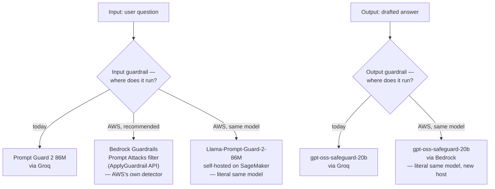
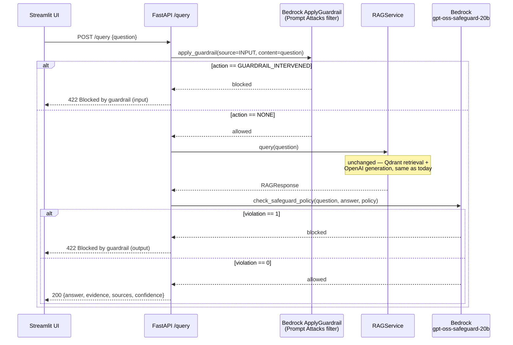
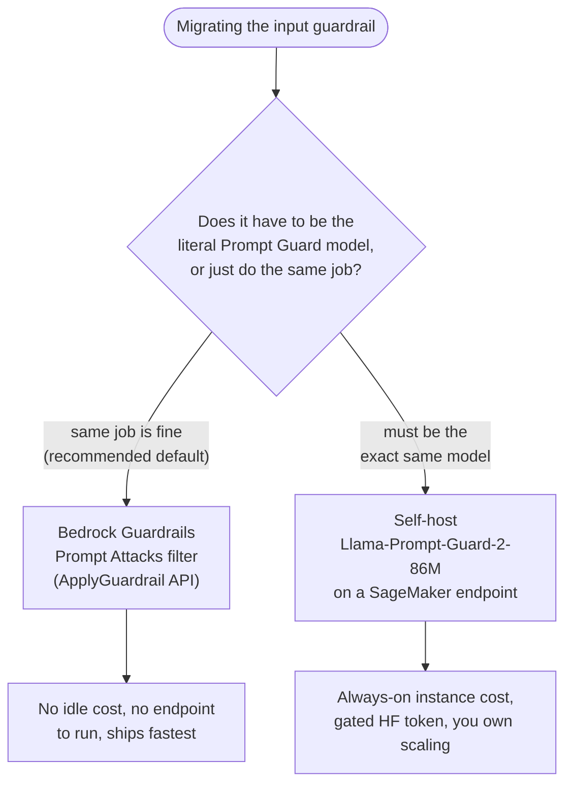

# Moving the Guardrails from Groq to AWS

This is a reference guide, not applied code — nothing in `src/core/guardrails.py` has been changed yet. It walks through moving MedRAG's two guardrails (input: Prompt Guard, output: safeguard policy) off Groq and onto AWS, and tells you exactly where the AWS path is the *same model* versus where it's *AWS's own equivalent*.


The output guardrail is the easy win: OpenAI's `gpt-oss-safeguard` family (both 20B and 120B) is a first-class Bedrock model, confirmed against AWS's own model card docs. The input guardrail is where you have a real decision to make — see Part B.




*The output side has one AWS branch and it's the same model either way. The input side is a real fork: AWS's native detector (fast, no hosting) or the literal Prompt Guard model (slower to stand up, but unchanged behavior).*

## Part A — Output guardrail: `gpt-oss-safeguard-20b` on Bedrock


### What's available

- **Model ID**: `openai.gpt-oss-safeguard-20b`
- **Context window**: 128K tokens, max output 16K
- **Regions** (on-demand, in-Region): `us-east-1`, `us-east-2`, `us-west-2`, `eu-west-1`, `eu-west-2`, `eu-central-1`, `eu-north-1`, `eu-south-1`, `ap-northeast-1`, `ap-south-1`, `ap-southeast-2`, `ap-southeast-3`, `ap-southeast-4`, `sa-east-1`
- **APIs**: `InvokeModel`, `Converse`, and — notably — an **OpenAI-compatible Chat Completions endpoint** (`bedrock-mantle`), which is the closest possible drop-in for how we already call it on Groq
- **Pricing**: ~$0.07/1M input tokens, ~$0.20/1M output tokens (check [aws.amazon.com/bedrock/pricing](https://aws.amazon.com/bedrock/pricing) for current numbers)


### Why this matters for our code

`check_safeguard_policy()` in `src/core/guardrails.py` already does nothing model-specific — it POSTs `{model, messages}` to an OpenAI-compatible `/chat/completions` endpoint and parses JSON out of the response. Bedrock's `bedrock-mantle` endpoint speaks that exact same OpenAI Chat Completions shape. So this genuinely is closer to "change a URL and an auth header" than "rewrite a function."

### Auth

Two paths, in order of preference:

1. **If this runs on the EC2 instance from** `infra/cloudformation/medrag-prod.yml` (see [aws_deployment_guide.md](aws_deployment_guide.md)): attach a Bedrock permissions policy to that stack's existing instance role instead of introducing new static credentials. The app already runs under an IAM-controlled instance — extend that role rather than bolting on access keys.
2. **Local dev / anywhere else**: a Bedrock long-term API key (Bedrock console → API keys), or standard `boto3` credential resolution (`~/.aws/credentials`, env vars, or an assumed role).

IAM policy needed (scope the resource ARN down once you know your account/region):

```json
{
  "Version": "2012-10-17",
  "Statement": [
    {
      "Effect": "Allow",
      "Action": ["bedrock:InvokeModel", "bedrock:InvokeModelWithResponseStream"],
      "Resource": "arn:aws:bedrock:*::foundation-model/openai.gpt-oss-safeguard-20b"
    }
  ]
}
```


### Reference implementation

Two equally valid options — pick based on how much you want to touch the existing code:

**Option 1 — keep using** `httpx` **against the OpenAI-compatible endpoint** (smallest diff from what exists today):

```python
def _bedrock_mantle_client(settings: AppSettings) -> httpx.Client | None:
    if not settings.aws_bedrock_api_key:
        return None
    return httpx.Client(
        base_url=f"https://bedrock-mantle.{settings.aws_region}.api.aws/v1",
        headers={"Authorization": f"Bearer {settings.aws_bedrock_api_key}"},
        timeout=settings.guardrail_timeout_seconds,
    )
```

Everything downstream — `_chat_completion()`, the JSON parsing in `check_safeguard_policy()` — is unchanged. This is the path that costs you the least code churn.

**Option 2 —** `boto3` **(**`invoke_model`**)**, if you'd rather use AWS's SDK and IAM-role auth instead of a long-term API key:

```python
import json
import boto3

def check_safeguard_policy_bedrock(
    question: str, answer: str, policy: str, settings: AppSettings
) -> GuardrailResult:
    client = boto3.client("bedrock-runtime", region_name=settings.aws_region)
    try:
        response = client.invoke_model(
            modelId="openai.gpt-oss-safeguard-20b",
            body=json.dumps({
                "messages": [
                    {"role": "system", "content": policy},
                    {"role": "user", "content": f"USER_QUESTION: {question}\n\nASSISTANT_ANSWER: {answer}"},
                ],
                "max_tokens": 512,
            }),
        )
        payload = json.loads(response["body"].read())
        content = payload["choices"][0]["message"]["content"]
        verdict = json.loads(content)
    except Exception:
        logger.warning("Bedrock safeguard call failed; allowing answer through.", exc_info=True)
        return GuardrailResult(allowed=True)

    if verdict.get("violation"):
        reason = str(verdict.get("rationale") or verdict.get("category") or "policy violation")
        return GuardrailResult(allowed=False, reason=reason)
    return GuardrailResult(allowed=True)
```

Same fail-open behavior as today, same parsing logic — only the transport changed. Add `boto3` to `pyproject.toml` if you go this route (it isn't a current dependency).

### New env vars

```bash
AWS_REGION=us-east-1
# Option 1:
AWS_BEDROCK_API_KEY=
# Option 2: rely on standard boto3 credential resolution instead (no new var needed
# if running on an EC2 instance role or with AWS CLI credentials already configured)
```


## Part B — Input guardrail: Prompt Guard has no direct AWS home

This is the one where "same model" and "easiest" pull in different directions.

### Option 1 (recommended): don't self-host Prompt Guard — use Bedrock's native Guardrails "Prompt Attacks" filter instead

Amazon Bedrock has its own built-in prompt-injection/jailbreak detector as part of **Bedrock Guardrails** — a managed policy resource, not a model you host. It's a different model under the hood than Meta's Prompt Guard, but it does the identical job in our architecture: classify a piece of text as an attack attempt before it reaches the LLM.

Critically, it supports being called **standalone**, via the `ApplyGuardrail` API — you don't have to route a full model invocation through it. That's the same shape our `check_prompt_injection()` already has: check the text, decide allow/block, and only then call the real LLM.

**Setup (one-time, console or API):**

1. Bedrock console → Guardrails → Create guardrail
2. In the "Prompt attacks" section, enable the filter and set strength to `HIGH`
3. Save — note the `guardrailIdentifier` and `guardrailVersion`

**Reference implementation:**

```python
import boto3

def check_prompt_injection_bedrock(question: str, settings: AppSettings) -> GuardrailResult:
    client = boto3.client("bedrock-runtime", region_name=settings.aws_region)
    try:
        response = client.apply_guardrail(
            guardrailIdentifier=settings.aws_guardrail_id,
            guardrailVersion=settings.aws_guardrail_version,
            source="INPUT",
            content=[{"text": {"text": question}}],
        )
    except Exception:
        logger.warning("Bedrock ApplyGuardrail call failed; allowing question through.", exc_info=True)
        return GuardrailResult(allowed=True)

    if response.get("action") == "GUARDRAIL_INTERVENED":
        return GuardrailResult(allowed=False, reason="Blocked by Bedrock Guardrails prompt-attack filter")
    return GuardrailResult(allowed=True)
```

> Double-check the exact response field names (`action`, `assessments`, etc.) against the current [ApplyGuardrail API reference](https://docs.aws.amazon.com/bedrock/latest/APIReference/API_agent-runtime_ApplyGuardrail.html) when you implement this — Bedrock's guardrails API has been actively evolving and field shapes can shift between doc revisions.

**Why this is the easier option:** no endpoint to run, no idle cost, no model weights to manage, and it's designed for exactly this "classify before generating" pattern. The tradeoff is honesty about what you're getting: it's AWS's own detector, not Meta's Prompt Guard, so its false-positive/false-negative behavior on your specific clinical-question phrasing is unproven until you test it — same caveat that applied to Prompt Guard itself.

IAM needed:

```json
{
  "Version": "2012-10-17",
  "Statement": [
    {
      "Effect": "Allow",
      "Action": "bedrock:ApplyGuardrail",
      "Resource": "arn:aws:bedrock:*:*:guardrail/*"
    }
  ]
}
```


### Option 2: self-host the actual `Llama-Prompt-Guard-2-86M` on a SageMaker real-time endpoint

If you specifically want the exact same model rather than AWS's equivalent, Prompt Guard's weights are open on Hugging Face and SageMaker can deploy arbitrary Hugging Face models via its standard `HuggingFaceModel` wrapper — it just isn't a JumpStart "one click" listing the way Llama Guard is.

**Gotcha to know upfront:** `meta-llama/Llama-Prompt-Guard-2-86M` is a gated Hugging Face repo — you need a Hugging Face account, to accept Meta's license on the model page, and a `HUGGING_FACE_HUB_TOKEN` with read access passed into the deployment.

**Deploy (run once, from a machine with** `sagemaker` **+** `boto3` **installed):**

```python
import sagemaker
from sagemaker.huggingface import HuggingFaceModel

role = "arn:aws:iam::<account-id>:role/<sagemaker-execution-role>"

hf_model = HuggingFaceModel(
    env={
        "HF_MODEL_ID": "meta-llama/Llama-Prompt-Guard-2-86M",
        "HF_TASK": "text-classification",
        "HUGGING_FACE_HUB_TOKEN": "<your-hf-token-with-accepted-license>",
    },
    role=role,
    transformers_version="4.49",
    pytorch_version="2.5",
    py_version="py311",
)

predictor = hf_model.deploy(
    initial_instance_count=1,
    instance_type="ml.c5.xlarge",  # CPU is plenty for an 86M classifier
    endpoint_name="prompt-guard-2-86m",
)
```

**Reference implementation for the guardrail call:**

```python
import boto3
import json

def check_prompt_injection_sagemaker(question: str, settings: AppSettings) -> GuardrailResult:
    client = boto3.client("sagemaker-runtime", region_name=settings.aws_region)
    try:
        response = client.invoke_endpoint(
            EndpointName=settings.aws_prompt_guard_endpoint,
            ContentType="application/json",
            Body=json.dumps({"inputs": question}),
        )
        result = json.loads(response["Body"].read())
    except Exception:
        logger.warning("SageMaker Prompt Guard call failed; allowing question through.", exc_info=True)
        return GuardrailResult(allowed=True)

    # HF text-classification pipelines return [{"label": ..., "score": ...}], not the
    # raw float string Groq returns — this is a genuinely different response shape,
    # not just a different transport. Confirm the actual label name against your
    # deployed endpoint's response before wiring this in (call it manually once first).
    top = result[0] if isinstance(result, list) else result
    label, score = str(top.get("label", "")).upper(), float(top.get("score", 0))
    is_malicious = ("MALICIOUS" in label or "1" in label) and score >= settings.prompt_guard_threshold
    if is_malicious:
        return GuardrailResult(allowed=False, reason=f"Prompt Guard flagged the question (label={label}, score={score:.4f})")
    return GuardrailResult(allowed=True)
```

**Why this is the harder option:** you're paying for `ml.c5.xlarge` (or whatever instance you pick) continuously while the endpoint is up, whether or not it's handling traffic — unlike Groq/Bedrock's pay-per-token model. You also own patching, scaling, and cold-start behavior. Worth it only if "the literal same model" is a hard requirement (e.g. you've already benchmarked Prompt Guard specifically and don't trust an untested alternative).

IAM needed:

```json
{
  "Version": "2012-10-17",
  "Statement": [
    { "Effect": "Allow", "Action": "sagemaker:InvokeEndpoint", "Resource": "arn:aws:sagemaker:*:*:endpoint/prompt-guard-2-86m" }
  ]
}
```


## The fully migrated request flow

Putting Part A and Part B's recommended paths together — this is what `/query` looks like if you take the Bedrock-native route for both guardrails (Part A, and Part B Option 1):




*Same shape as the Groq-based flow today — only the two guardrail calls change destination.* `RAGService.query()` *in the middle is untouched either way, exactly like the original design intended.*

## Decision guide


|                      | Groq (current)   | Bedrock native Guardrails   | SageMaker self-hosted Prompt Guard |
| -------------------- | ---------------- | --------------------------- | ---------------------------------- |
| Same model as today? | —                | No (AWS's own detector)     | Yes                                |
| Setup effort         | Done             | Low — console click-through | Medium — deploy + license gate     |
| Idle cost            | None             | None (pay-per-check)        | Yes — instance runs continuously   |
| Ops burden           | None             | None                        | You own patching/scaling           |
| Best for             | What we have now | Fastest AWS migration       | When the exact model matters       |


**Recommendation**: Output guardrail → Bedrock (`gpt-oss-safeguard-20b`, Option 1 or 2 above) — no real downside, same model. Input guardrail → start with Bedrock's native Prompt Attacks filter (Option 1); only move to self-hosting the literal Prompt Guard model if you specifically find the native filter's behavior doesn't match what you validated with Prompt Guard.




## New env vars (summary)

```bash
AWS_REGION=us-east-1
AWS_BEDROCK_API_KEY=                 # if using the OpenAI-compatible endpoint for output guardrail
AWS_GUARDRAIL_ID=                    # Bedrock Guardrails resource, for input guardrail Option 1
AWS_GUARDRAIL_VERSION=DRAFT
AWS_PROMPT_GUARD_ENDPOINT=prompt-guard-2-86m   # only if self-hosting, input guardrail Option 2
```

Same `GROQ_API_KEY`-style pattern applies: presence of the relevant AWS config toggles that path on, absence means it no-ops and allows through — keep the fail-open behavior regardless of which backend you land on.

## Testing before you cut over

1. Run the same battery from the original Groq rollout: a benign clinical question, an obvious jailbreak attempt, and a direct call to the safeguard with a deliberately bad answer (see the "Guardrails" tab in the Streamlit UI — `POST /guardrails/test-input` / `POST /guardrails/test-output` work identically regardless of which backend `guardrails.py` calls under the hood).
2. If you switch the input guardrail to Bedrock's native filter, re-run it against real guideline questions specifically — its false-positive behavior on clinical/directive language ("administer 500mg," "must not exceed") is unproven until tested, same caution that applied to Prompt Guard itself.
3. Keep the fail-open + short-timeout pattern from the original design regardless of backend — an AWS outage should degrade you to unguarded, not take query-answering down.

